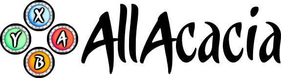

# Welcome to the antics of yours truly, AllAcacia!

## About Me
*(He/him)*
I'm a 3rd-year Computer Engineering student: I like taking part in floral photography, drawing, gaming, and binge-coding in my free time.  
## Programming Experience
My programming history includes years of practice in Python3 and C, and if I require anything else I can teach myself to use it.  
## Current Projects
I am currently working on a big project I call "Card-Jitsu Quartet", which is a recreation of one of Club Penguin's series of minigames (before their unfortunate shutdown). The target platform is the Nintendo 3DS, using the **devkitARM/libctru** toolchain! The main repository is private (because of Disney's IP), although I host a public repository for the source code. Through this project I have learnt a lot on how to approach making a game engine (at least on the 3DS), with help via **devkitPro's "3ds-examples"** library.  
## How to Reach Me
If you'd like to talk or seek advice on 3DS Homebrew development, be no stranger and reach out to me via Discord! **(all.acacia)** *Please make sure you're part of the Nintendo Homebrew server so I don't mistake you as a bot and ignore you.*
<!--
**AllAcacia/AllAcacia** is a ✨ _special_ ✨ repository because its `README.md` (this file) appears on your GitHub profile.

Here are some ideas to get you started:

- 🔭 I’m currently working on ...
- 🌱 I’m currently learning ...
- 👯 I’m looking to collaborate on ...
- 🤔 I’m looking for help with ...
- 💬 Ask me about ...
- 📫 How to reach me: ...
- 😄 Pronouns: ...
- ⚡ Fun fact: ...
-->
